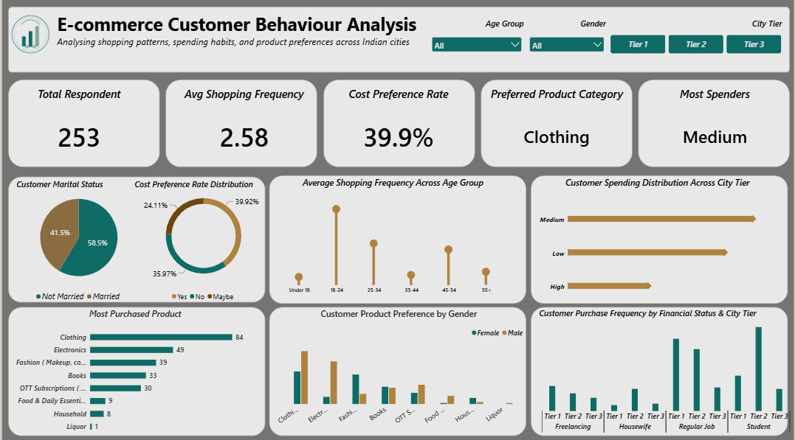
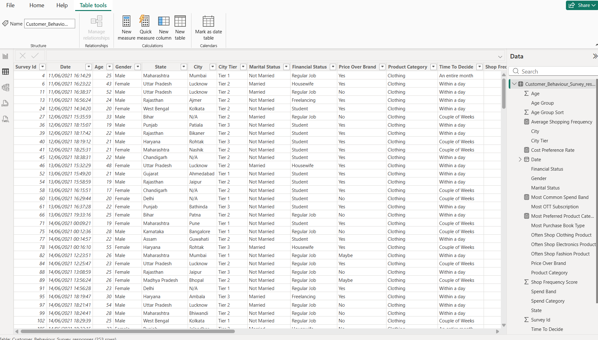
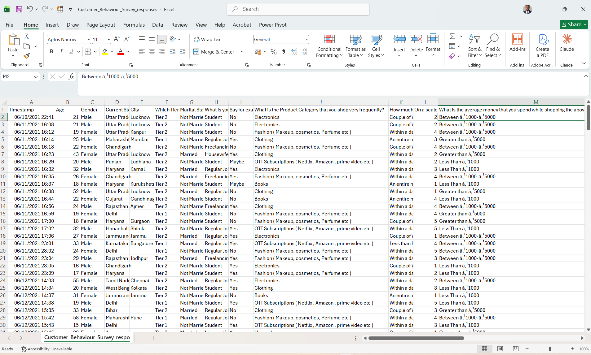

# 🛍 E-commerce Customer Behaviour Analysis — Indian Cities

## Table of Contents

- [Project Overview](#-project-overview)
- [Dashboard Preview](#-dashboard-preview)
- [Problem Statement](#-problem-statement)
- [Data Cleaning & Preparation](#-data-cleaning--preparation)
- [Exploratory Data Analysis](#-exploratory-data-analysis-eda)
- [Key Findings & Strategic Recommendations](#-key-findings--strategic-recommendations)
- [Tools & Techniques](#-tools--techniques)

---

## 📌 Project Overview

This project presents an **E-commerce Customer Behaviour Analysis Dashboard**, built in Power BI, analyzing 253 customer survey responses to understand shopping patterns, spending habits, and product preferences across Indian cities.

The dashboard transforms raw survey data into actionable insights on customer segments, price sensitivity, and product demand, supporting marketing and product strategy decisions.

---

## 🖼 Dashboard Preview

*Interactive Power BI dashboard with slicers for Age Group, Gender, and City Tier, showing Total Respondents, Average Shopping Frequency, Cost Preference Rate, Preferred Product Category, and Most Spenders KPIs, alongside demographic and spending breakdowns.*

---

## 📂 Data Source

The raw data source used for this analysis is `Customer_Behaviour_Survey_responses.csv`, containing 253 survey responses covering demographics, shopping frequency, spending habits, and product preferences across Indian cities.

[Download here](data/Customer_Behaviour_Survey_responses.csv)

---

## 🎯 Problem Statement

The analysis was designed to:

- Understand how shopping frequency varies across age groups.
- Segment customers by spending level and city tier.
- Identify the most purchased product categories overall and by gender.
- Measure how price-sensitive customers are relative to brand preference.
- Understand how purchase frequency varies by financial status and city tier.
- Provide data-driven recommendations to guide marketing and product strategy.

---

## 🖌 Data Cleaning & Preparation

### Issues Identified

- Survey export used full question text as column headers (e.g. *"What is the Product Category that you shop very frequently?"*) instead of concise field names.
- Spend range values contained corrupted currency symbols from an encoding issue (e.g. `Between ‘1000-‘5000`).
- Missing values in **City** and **Financial Status** for some respondents.
- Categorical fields such as Marital Status and Financial Status needed standardising for consistent grouping.

### Steps Taken

- Renamed survey question columns to short, analysis-ready field names (Age, Gender, City, City Tier, Marital Status, Financial Status, Price Over Brand, Product Category, Time To Decide, Shop Frequency, etc.).
- Cleaned and re-encoded the spend range text to remove corrupted characters.
- Built calculated columns and measures in Power BI, including **Age Group**, **Spend Band**, **Spend Category**, **Most Common Spend Band**, **Cost Preference Rate**, and **Average Shopping Frequency**.
- Handled missing values in City and Financial Status appropriately for reporting.

---

## 🔍 Exploratory Data Analysis (EDA)

### Key Business Questions Explored

1. Which age groups shop most frequently, and how does shopping frequency change across age bands?
2. How is customer spending distributed across city tiers?
3. What are the most purchased product categories overall, and how does preference differ by gender?
4. How price-sensitive are customers — do they prioritise price over brand?
5. How does purchase frequency vary by financial status (Student, Regular Job, Freelancing, Housewife) across city tiers?
6. What is the split between married and unmarried customers, and how might this relate to spending behaviour?

---

## 📈 Key Findings & Strategic Recommendations

### 1. 👕 Clothing Dominates Purchases

**Finding**
**Clothing** is by far the most purchased category (84 respondents), followed by Electronics (49) and Fashion/Makeup & Cosmetics (39), with Household and Liquor the least purchased.

**Recommendation**
- Prioritise Clothing in marketing spend and homepage placement.
- Cross-sell Electronics and Fashion items alongside Clothing purchases, given their strong secondary demand.

### 2. 🎯 Younger Shoppers Are the Most Frequent

**Finding**
The **18–24 age group** shows the highest average shopping frequency of any age band, tapering off in older groups.

**Recommendation**
- Focus acquisition campaigns and app/social engagement on the 18–24 segment.
- Design loyalty or subscription features aimed at converting frequent young shoppers into repeat customers.

### 3. 💳 Medium Spenders Are the Core Segment

**Finding**
**Medium** spenders are both the most common spender type overall and the leading spend band across city tiers, ahead of Low and High spenders.

**Recommendation**
- Build retention and upsell campaigns targeted at Medium spenders to shift them toward higher spend bands.
- Avoid over-indexing marketing spend on the smaller High-spend segment at the expense of the larger Medium segment.

### 4. 💰 Meaningful Price Sensitivity

**Finding**
The overall **Cost Preference Rate is 39.9%**, meaning a substantial share of customers prioritise price over brand when shopping.

**Recommendation**
- Use targeted discounting and value bundles for the price-sensitive segment rather than blanket discounts.
- Test brand-focused messaging separately for the remaining ~60% who are less price-driven.

### 5. 👥 Purchase Frequency by Financial Status

**Finding**
**Students** and customers in **Regular Jobs** show the strongest purchase activity across city tiers, compared to Freelancing and Housewife segments.

**Recommendation**
- Tailor promotions (student discounts, payday-timed offers) to these two high-activity segments.
- Investigate lower engagement among Freelancing and Housewife segments to identify barriers to purchase frequency.

---

## 💡 Overall Business Takeaway

The analysis shows that **age, spend band, and financial status** are the strongest drivers of shopping behaviour, with Clothing as the dominant category, 18–24-year-olds as the most frequent shoppers, and Medium spenders forming the core customer base.

The business can grow revenue by **doubling down on Clothing and cross-sell categories, focusing acquisition on younger and Student/Regular Job segments, and using targeted pricing for the price-sensitive share of customers** rather than uniform strategies across all segments.

---

## 🛠 Tools & Techniques

- **Power BI** — Data modeling, DAX measures, and dashboard visualization
- **Power Query** — Data cleaning, column renaming, and encoding fixes
- **DAX** — Calculated measures (Cost Preference Rate, Average Shopping Frequency, Spend Band/Category, etc.)
- **Microsoft Excel** — Source survey data inspection
